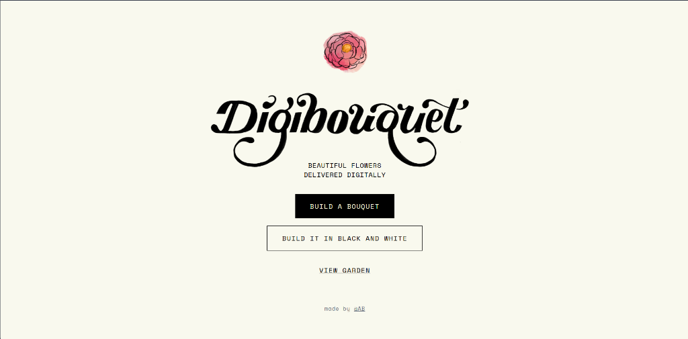
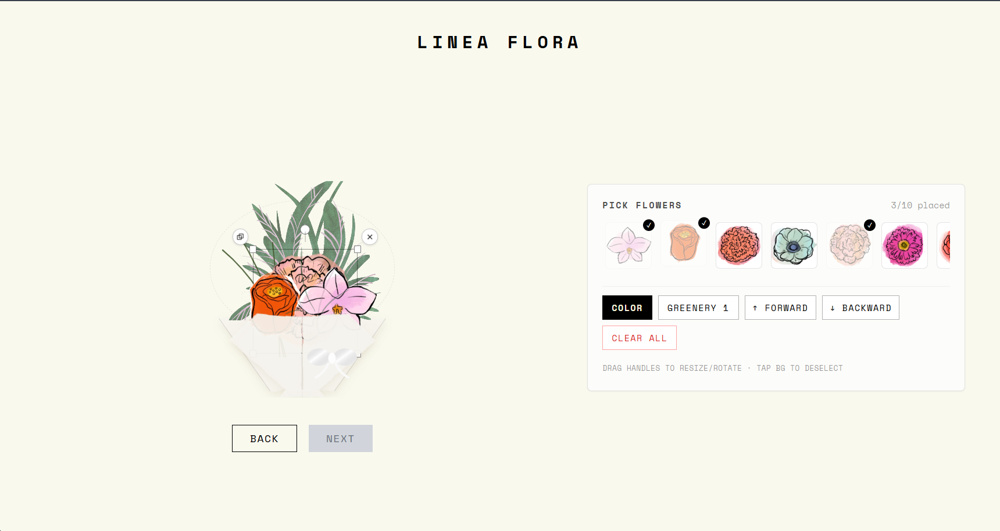
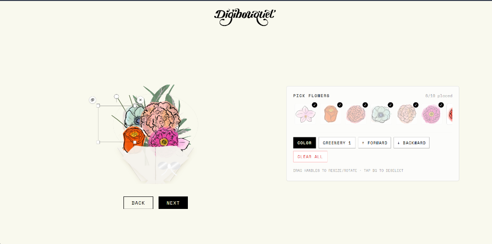
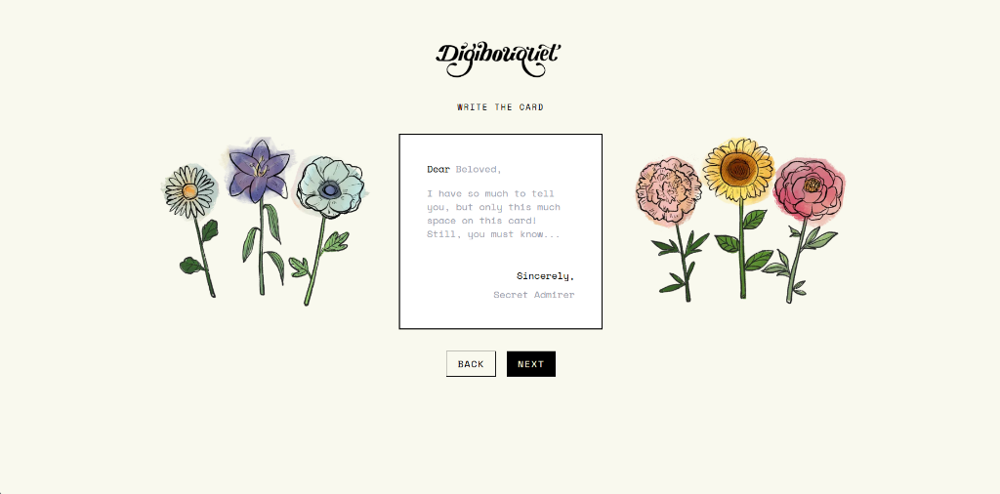
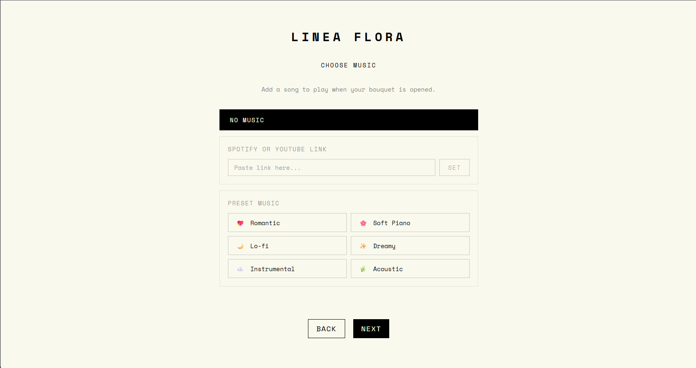
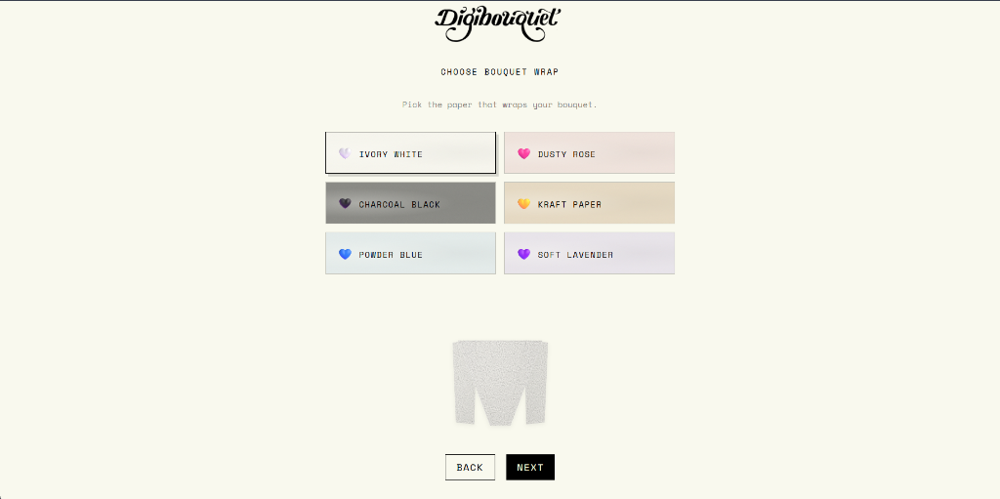
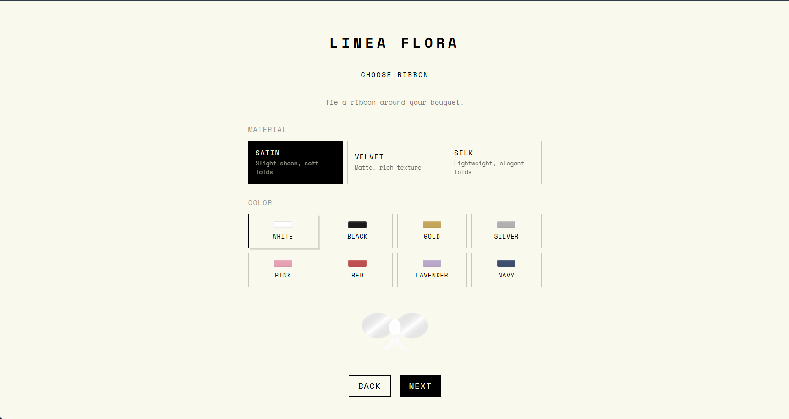
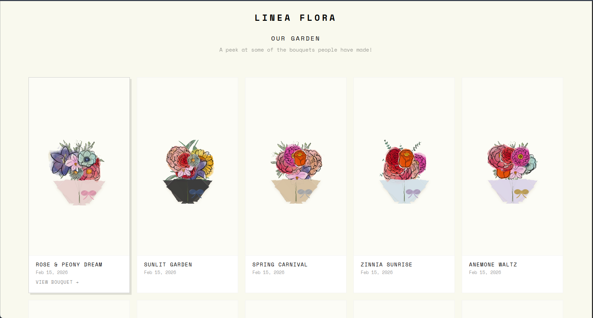

# 🌸 Linea Flora — Send a Digital Flower Bouquet

Linea Flora (formerly DigiBouquet) is a beautiful, interactive web application that allows users to design custom digital flower bouquets, write personalized greeting cards, select ambient soundtracks, and share their creations with loved ones.

Featuring a hand-drawn illustration aesthetic, smooth transitions, and intuitive design canvas controls, Linea Flora brings the warmth of gifting flowers to the digital world.

---

## Live Demo
[](https://linea-flora-ab.vercel.app/)

---

## ✨ Recent Updates
- **Rebranded to Linea Flora**: Updated the website name, main headers, landing screen, shared bouquet cards, and window titles to the elegant new brand *Linea Flora*.
- **Custom Favicon Integration**: Integrated the new signature floral bouquet image as the website's favicon.
- **Enhanced SEO & Social Metadata**: Added comprehensive metadata including description, keywords, author, and theme-color tags. Enabled rich social link previews by configuring Open Graph (OG) and Twitter Card tags.
- **Flower Selection Bounding Box Fix**: Resolved a critical layout alignment bug in the builder canvas where the selection bounding box, resize handles, and delete/duplicate buttons were offset far above and to the left of the flower. The bounding box, handles, and action buttons now frame the flower image perfectly and rotate in synchrony with it.

---

## 📸 Interface Showcase

Below is the complete 8-step journey of crafting and sending a digital bouquet.

### Step 1: Landing & Style Choice
Welcome to the garden! Start building your custom digital bouquet in full vibrant colors or classic hand-drawn black and white sketches.


### Step 2: Canvas Construction (Greenery)
Choose your greenery style and start placing flowers onto the bouquet canvas.


### Step 3: Bouquet Customization (Flowers)
Interactively scale, rotate, move, and layer each flower to build a gorgeous, personalized arrangement.


### Step 4: Card Writing
Write a custom note for your card—complete with custom headers and sign-offs—surrounded by elegant floral drawings.


### Step 5: Music Curation
Select a background tune (either preset acoustic melodies or a custom Spotify/YouTube link) that will play when your recipient opens the bouquet.


### Step 6: Wrapping Selection
Pick the perfect color and style of paper to wrap up your custom flower bouquet.


### Step 7: Ribbon Tie
Choose a ribbon style (satin, velvet, or silk) and color to tie your digital bouquet together.


### Step 8: Final Presentation & Share
View the final interactive presentation of the wrapped bouquet. Play your background music, open the customized card, and generate a lightweight shareable link to send to your recipient.


---

## ✨ Features

- **Interactive Canvas Builder**: Drag, resize, rotate, and layer up to 10 beautiful flowers and foliage elements.
- **Customizable Card Screen**: Draft a personalized digital card to accompany your bouquet.
- **Music Selection**: Add ambient music to play while your recipient unwraps their bouquet.
- **Wrapping & Ribbon Curation**: Tie the bouquet together with a choice of wrapping paper styles and decorative ribbons.
- **Vibrant Color vs. Sketch Modes**: Build your bouquet in full color or classic pencil sketch style.
- **The Garden (Saved Bouquets)**: Save your completed bouquets locally in your personal "Garden" grid to view, share, or delete them anytime.
- **URL-Based Sharing**: Share your custom bouquet via a lightweight base64 encoded URL state—no database required!

---

## 🛠️ Technology Stack

- **Framework**: [React](https://react.dev/) (v19)
- **Bundler & Build Tool**: [Vite](https://vite.dev/)
- **Animations**: [Framer Motion](https://www.framer.com/motion/)
- **Styles**: [Tailwind CSS](https://tailwindcss.com/)
- **Icons**: [Lucide React](https://lucide.dev/)
- **Components**: [Radix UI Tooltip](https://www.radix-ui.com/) (accessible tooltips)

---

## 🚀 Running Locally

Follow these instructions to run the application on your computer.

### 📋 Prerequisites

Ensure you have **Node.js** (v18+) and **npm** installed on your system.

### 1. Clone & Navigate
```bash
git clone <repository-url>
cd DigiBouquet
```

### 2. Install Dependencies
```bash
npm install
```

### 3. Start Development Server
```bash
npm run dev
```
Open your browser and navigate to the local server URL (usually `http://localhost:5173`).

### 4. Build for Production
```bash
npm run build
```
This command compiles and optimizes the assets into the `dist/` directory, ready to be hosted on any static web hosting provider (Vercel, Netlify, GitHub Pages, etc.).
